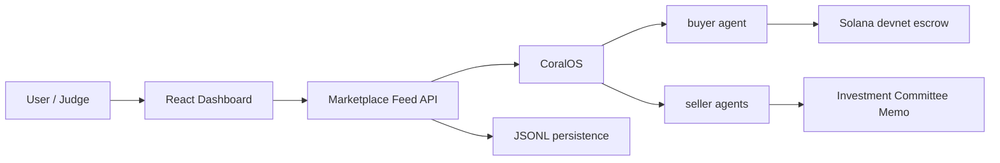
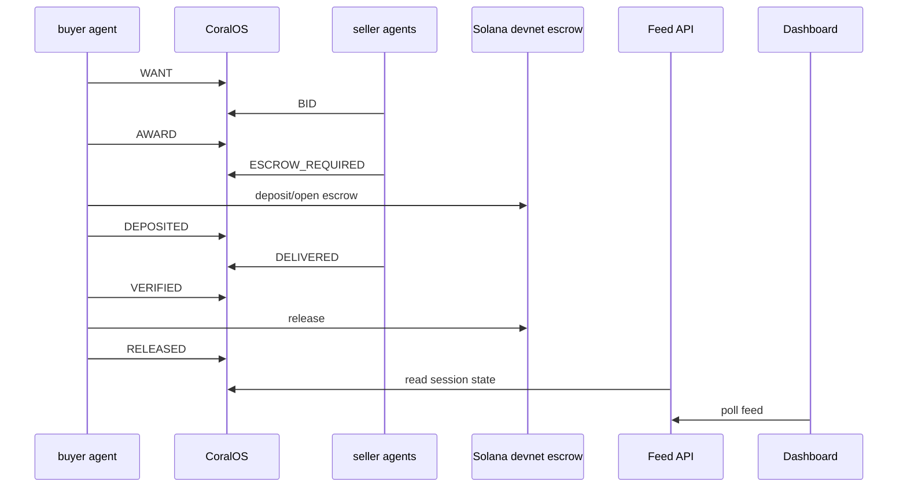

# Architecture

## System Context

OmniQuantAI coordinates a market session between a buyer agent and specialist seller agents. CoralOS carries the agent messages. The marketplace feed folds those messages into dashboard state. Solana devnet escrow proves settlement.

The current demo uses a four-agent bootstrap roster, but the architecture target is an open marketplace where many specialist agents can discover work, compete, deliver, earn, and build reputation.

## Components

| Component | Path | Current role |
| --- | --- | --- |
| Dashboard | `examples/marketplace/web` | Start Market UX and lifecycle display |
| Feed API | `examples/marketplace/feed` | Starts sessions, reads CoralOS, folds rounds |
| Buyer agent | `coral-agents/buyer-agent` | WANT, scoring, award, verification, settlement |
| Seller agent | `coral-agents/seller-agent` | Bid, escrow check, memo delivery |
| Runtime | `packages/agent-runtime` | Protocol helpers, CoralOS client, Solana guards |
| Marketplace launcher | `examples/marketplace/start.ts` | Launches the buyer and configured seller roster |

## Lifecycle Sequence

## Event Model

The market protocol is text-based and parsed by shared helpers in `packages/agent-runtime/src/market/protocol.ts`. The feed converts raw transcript messages into typed rounds in `examples/marketplace/feed/src/foldRounds.ts`.

## Session Propagation

The dashboard calls `POST /api/sessions/start`. The feed launches `examples/marketplace/start.ts`, parses the generated session and namespace, and returns them to the frontend. The dashboard then polls `/api/feed?session=<id>&namespace=omniquant`.

## Data Providers

Seller agents use live-if-available providers and deterministic fallback data. Missing API keys must never break the demo.

## Memo And Verification

The winning seller delivers an Investment Committee Memo. The buyer runs deterministic completeness checks before releasing payment.

## Settlement

Current settlement is Solana devnet. The buyer now routes direct escrow and arbiter-gated settlement through `coral-agents/buyer-agent/src/settlement.ts`.

## Persistence

The feed persists JSONL records for sessions, requests, bids, winners, settlements, memos, and reputation snapshots under the configured data directory.

## Known Constraints

- Full live demo requires Docker and CoralOS.
- Devnet RPC or faucet issues can affect settlement timing.
- File-backed persistence is not a high-scale production database.
- Mainnet is intentionally blocked.

## Six-Layer Platform

See `docs/platform-layers.md` for the strategic architecture:

1. Financial Data Layer
2. Intelligence Layer
3. Marketplace Layer
4. Financial Intelligence Graph
5. Settlement Layer
6. Developer Platform
