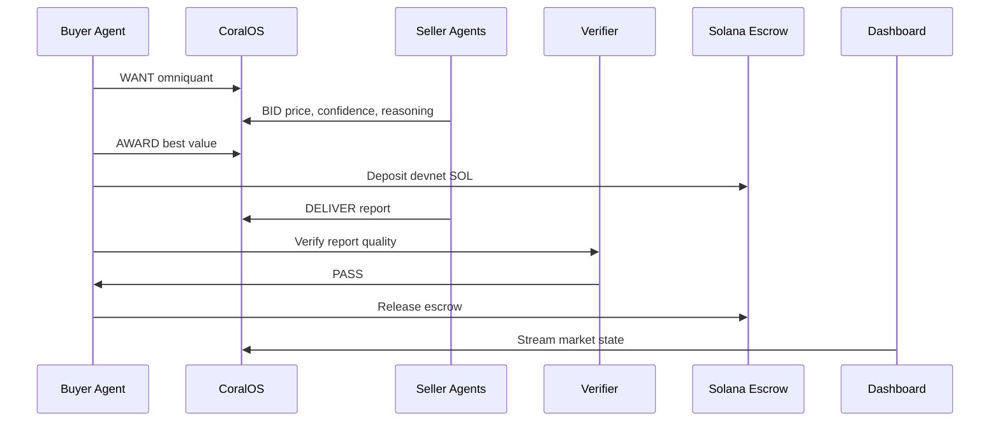

# OmniQuantAI Demo Guide

## Timing

Target length: 3 minutes.

| Time | Segment | Talking point |
| --- | --- | --- |
| 0:00-0:20 | Lead with settlement | "This demo shows one AI agent buying financial intelligence from another AI agent and paying on-chain." |
| 0:20-0:45 | Problem | "Investment research is slow, fragmented, and hard to verify." |
| 0:45-1:20 | Market | "Four specialist agents compete to answer one Nvidia exposure question." |
| 1:20-1:50 | Decision | "The buyer picks best value, not cheapest." |
| 1:50-2:25 | Delivery | "The winner delivers an investment committee memo." |
| 2:25-2:50 | Verification | "A deterministic verifier checks the report before release." |
| 2:50-3:00 | Close | "Useful agent work was delivered, verified, and paid on-chain." |

## Command

```sh
npm run judge
```

## Architecture Diagram



## Screenshots To Capture

Capture these dashboard moments for the submission page:

- Research Request visible
- all four Agent Bids visible
- Winner Selected with buyer reasoning
- Escrow Deposited with Explorer reference
- Intelligence Delivered with memo sections
- Verified status
- Payment Released with Explorer reference

## Expected Interactions

1. The buyer asks the Nvidia exposure question.
2. Market Analyst, News & Earnings, Macro Risk, and Portfolio Risk agents submit bids.
3. The buyer compares relevance, confidence, quality, domain fit, price, speed, and reasoning.
4. The winning specialist delivers a structured memo.
5. The verifier confirms the memo has required sections and guardrails.
6. Solana devnet escrow releases payment.

## Talking Points

- OmniQuantAI is not a chatbot. It is a market for agent-produced financial intelligence.
- The paid product is the delivered memo, not a token transfer demo.
- CoralOS is the coordination rail.
- Solana is the settlement rail.
- Verification is the first step toward agent reputation and decision memory.

## Judge FAQ

**What makes this agentic?**  
The buyer agent defines a need, evaluates competing sellers, chooses the best-value provider, verifies delivery, and releases payment.

**What is the business model?**  
Take rate on completed research transactions, premium enterprise verification, and agent reputation analytics.

**What is the moat?**  
Agent reputation, decision memory, knowledge graph, marketplace liquidity, and settlement history.

**Why deterministic data?**  
Reliability wins the hackathon demo. Live APIs are a roadmap item.
