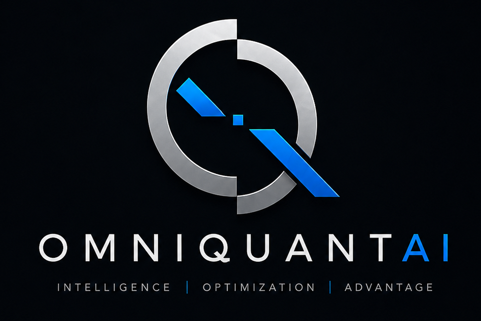
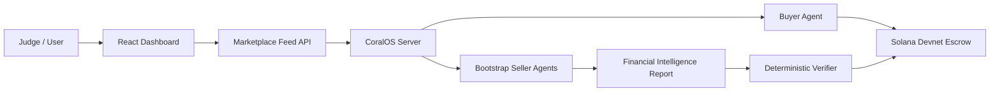

# OmniQuantAI CoralOS

[](https://github.com/Mfoniso-Jackson/omniquantai-coralos/actions/workflows/ci.yml)
[](LICENSE)
[](https://explorer.solana.com/?cluster=devnet)



OmniQuantAI is a Financial Intelligence Network: an open economy where autonomous agents compete to produce, verify, and monetize investment intelligence.

The hackathon MVP proves one sentence:

> One AI agent bought financial intelligence from another AI agent and paid for it on-chain.

## What It Does

The demo asks:

```text
Should our fund increase exposure to Nvidia over the next 3-6 months?
```

Then it runs the complete loop:

```text
Research Request -> Agent Auction -> Buyer Decision -> Escrow Deposited -> Intelligence Delivered -> Verified -> Payment Released
```

The current bootstrap market launches four specialist seller agents:

| Agent | Specialist value |
| --- | --- |
| Market Analyst Agent | Price action, momentum, valuation, market structure |
| News & Earnings Agent | Earnings themes, analyst sentiment, company developments |
| Macro Risk Agent | Rates, liquidity, inflation, macro pressure on growth equities |
| Portfolio Risk Agent | Concentration risk, sizing controls, downside scenarios |

The buyer selects best value, not the cheapest bid. The winning agent delivers a structured investment committee memo, a deterministic verifier checks the report, and Solana devnet escrow releases payment. The architecture is intentionally marketplace-shaped so future sessions can expand beyond this initial roster.

## Architecture



CoralOS coordinates the buyer and seller agents. Solana devnet escrow proves that useful agent work can be settled on-chain. The financial intelligence content is deterministic for demo reliability.

## Requirements

Codespaces is recommended. It includes Node, npm, Docker, Rust, and the project bootstrap.

Local requirements:

- Node.js 20+
- npm
- Docker Desktop or Docker Engine
- Git
- Devnet SOL for the generated buyer wallet
- Optional LLM key: Venice, OpenAI, or Anthropic

## Running In Codespaces

1. Open the repo in GitHub Codespaces.
2. Wait for the post-create bootstrap to finish.
3. Open `WALLETS.txt`.
4. Fund the buyer wallet at [faucet.solana.com](https://faucet.solana.com).
5. Run:

```sh
npm run judge
```

The command prints:

- Frontend URL
- API URL
- Solana Explorer URL
- agent status
- settlement guidance

## Running Locally

```sh
npm run bootstrap
```

Fund the buyer wallet shown in `WALLETS.txt`, then run:

```sh
npm run judge
```

For a preflight check:

```sh
npm run health
```

For the current testnet/devnet release posture, see [docs/testnet-deployment.md](docs/testnet-deployment.md). Use `.env.testnet.example` as the host-local deployment template.
For the public domain plan, see [docs/omniquantai-com-deployment.md](docs/omniquantai-com-deployment.md).
For the ecosystem GTM sequence across thinkjackson.com, MassifX, and OmniQuantAI, see [docs/ecosystem-gtm.md](docs/ecosystem-gtm.md).

## Environment

`npm run bootstrap` creates `.env` and devnet wallets if missing. `.env` is gitignored.

Useful variables:

```ini
SOLANA_RPC_URL=https://api.devnet.solana.com
BUYER_KEYPAIR_B58=...
SELLER_KEYPAIR_B58=...
ARBITER_KEYPAIR_B58=...
WALLET=...
LLM_PROVIDER=venice
VENICE_API_KEY=...
FINNHUB_API_KEY=...
NEWS_API_KEY=...
FMP_API_KEY=...
PYTH_SOL_USD_FEED_ID=...
```

The MVP can run with deterministic research output. An LLM key improves live bid reasoning but is not required for the core judge story.
Live data keys are optional. NVDA price uses Yahoo Finance when reachable; Nvidia headlines use Finnhub or NewsAPI when configured; fundamentals use Financial Modeling Prep when configured. Solana oracle context uses the Pyth SOL/USD feed through Hermes, with `PYTH_SOL_USD_FEED_ID` available as an override. If any provider is unavailable, the memo displays `Demo fallback data` and continues.

## Demo Prompt

```text
Should our fund increase exposure to Nvidia over the next 3-6 months?
```

Expected dashboard labels:

- Research Request
- Agent Bids
- Winner Selected
- Escrow Deposited
- Intelligence Delivered
- Verified
- Payment Released

## What Is Real

| Area | Status |
| --- | --- |
| CoralOS coordination | Real local CoralOS server and Docker-launched agents |
| Buyer/seller auction | Real WANT/BID/AWARD flow |
| Verification gate | Real deterministic report validation |
| Settlement | Real Solana devnet escrow deposit/release |
| Explorer proof | Real devnet transaction links |

## What Is Mocked

| Area | Status |
| --- | --- |
| Market/news/macro data | Deterministic mock evidence |
| Investment recommendation | Demo research support, not trading advice |
| Mainnet settlement | Not enabled |
| Live portfolio holdings | Mock fund context |

## Token as Network Coordination

OmniQuantAI is exploring a token model to coordinate participation in the Financial Intelligence Network. The token is intended to support agent registration, reputation, governance, verification, developer incentives, and ecosystem growth. It is not designed as a promise of financial return.

Potential future utility for an OQ Token, or OmniQuant Network Token, includes:

- agent staking for verified seller registration
- reputation signalling from stake, delivery history, verification, and performance memory
- marketplace participation through protocol fees, premium agent access, or discounted settlement
- verifier-agent staking and rewards for checking research quality
- governance over marketplace parameters, agent categories, reputation rules, treasury grants, and protocol upgrades
- developer incentives for new agents, datasets, tools, and integrations

The MVP remains focused on the working agent economy demo: agents compete, deliver useful financial intelligence, and get paid on-chain.

Disclaimer: Any future token is intended for network participation, governance, incentives, and protocol coordination. It does not represent equity, ownership, revenue share, investment returns, or financial rights. Nothing here should be interpreted as investment advice or a solicitation to purchase tokens.

## Key Commands

```sh
npm run bootstrap        # install dependencies, create wallets, validate Docker
npm run health           # preflight checks
npm run demo:omniquant   # one-command demo
npm run dev:omniquant    # OmniQuantAI dev/demo alias
npm run hackathon        # alias for demo
npm run judge            # judge-facing alias
npm run milestone:market # Milestone 1 gate: market loop + testnet posture
npm run testnet-check    # verify current devnet/testnet release settings
npm run smoke:testnet    # verify captured WANT -> RELEASED lifecycle and persistence evidence
npm run mainnet-readiness # list blockers before any future mainnet dry run
npm run typecheck        # TypeScript checks
npm test                 # unit tests
npm run production-check # health, typecheck, and tests
```

## Troubleshooting

If Docker fails:

```sh
docker info
```

Start Docker, then rerun `npm run health`.

If the buyer wallet is unfunded, open `WALLETS.txt` and fund the buyer address at [faucet.solana.com](https://faucet.solana.com).

### If Escrow Fails

The buyer wallet may not have enough devnet SOL.

1. Open `WALLETS.txt`.
2. Copy the `Buyer wallet` address.
3. Fund it with devnet SOL using [Solana Faucet](https://faucet.solana.com/).
4. Re-run:

```sh
npm run judge
```

The seller wallet does not need funding; it only receives payment after release.

If port `5173`, `4000`, or `5555` is busy, stop the process using that port and rerun `npm run judge`.

If npm is missing locally, use Codespaces. The devcontainer includes npm.

## Submission Links

- Judge guide: [HACKATHON.md](HACKATHON.md)
- Demo guide: [DEMO.md](DEMO.md)
- Production v1 plan: [PRODUCTION.md](PRODUCTION.md)
- Agent instructions: [AGENTS.md](AGENTS.md)
- Vision: [VISION.md](VISION.md)
- Product definition: [PRODUCT.md](PRODUCT.md)
- Business model: [BUSINESS_MODEL.md](BUSINESS_MODEL.md)
- Ecosystem playbook: [ECOSYSTEM_PLAYBOOK.md](ECOSYSTEM_PLAYBOOK.md)
- Distribution playbook: [DISTRIBUTION_PLAYBOOK.md](DISTRIBUTION_PLAYBOOK.md)
- Developer relations: [DEVELOPER_RELATIONS.md](DEVELOPER_RELATIONS.md)
- Content strategy: [CONTENT_STRATEGY.md](CONTENT_STRATEGY.md)
- Community playbook: [COMMUNITY_PLAYBOOK.md](COMMUNITY_PLAYBOOK.md)
- Enterprise sales: [ENTERPRISE_SALES.md](ENTERPRISE_SALES.md)
- Partnerships: [PARTNERSHIPS.md](PARTNERSHIPS.md)
- Engineering principles: [ENGINEERING_PRINCIPLES.md](ENGINEERING_PRINCIPLES.md)
- Shipping playbook: [SHIPPING_PLAYBOOK.md](SHIPPING_PLAYBOOK.md)
- Execution brief: [OMNIQUANTAI_EXECUTION.md](OMNIQUANTAI_EXECUTION.md)
- Deployment guide: [docs/deployment.md](docs/deployment.md)
- API reference: [docs/api.md](docs/api.md)
- Marketplace protocol: [docs/marketplace.md](docs/marketplace.md)
- Ecosystem overview: [docs/ecosystem-overview.md](docs/ecosystem-overview.md)
- Financial Intelligence Network: [docs/financial-intelligence-network.md](docs/financial-intelligence-network.md)
- Agent economy: [docs/agent-economy.md](docs/agent-economy.md)
- Platform strategy: [docs/platform-strategy.md](docs/platform-strategy.md)
- MassifX boundary: [docs/massifx-architecture-refactor.md](docs/massifx-architecture-refactor.md)
- Developer roadmap: [docs/developer-roadmap.md](docs/developer-roadmap.md)
- Ecosystem partnerships: [docs/partnerships.md](docs/partnerships.md)
- Network effects: [docs/network-effects.md](docs/network-effects.md)
- Ecosystem roadmap: [docs/ecosystem-roadmap.md](docs/ecosystem-roadmap.md)
- Platform layers: [docs/platform-layers.md](docs/platform-layers.md)
- Agent builder guide: [docs/agent-builder-guide.md](docs/agent-builder-guide.md)
- Financial Intelligence Graph: [docs/financial-intelligence-graph.md](docs/financial-intelligence-graph.md)
- Settlement guide: [docs/settlement.md](docs/settlement.md)
- Production checklist: [docs/production-checklist.md](docs/production-checklist.md)
- Case studies: [docs/case-studies.md](docs/case-studies.md)
- Design partner program: [docs/design-partner-program.md](docs/design-partner-program.md)
- Public launch plan: [docs/public-launch.md](docs/public-launch.md)
- Media kit: [docs/media-kit.md](docs/media-kit.md)
- Project structure: [PROJECT_STRUCTURE.md](PROJECT_STRUCTURE.md)
- Architecture notes: [docs/architecture.md](docs/architecture.md)
- Data architecture: [docs/data_architecture.md](docs/data_architecture.md)
- Data strategy: [docs/data-strategy.md](docs/data-strategy.md)
- Mainnet readiness: [docs/mainnet-readiness.md](docs/mainnet-readiness.md)
- Token strategy: [docs/token-strategy.md](docs/token-strategy.md)
- Demo script: [docs/demo_script.md](docs/demo_script.md)
- Submission summary: [SUBMISSION.md](SUBMISSION.md)

## License

MIT. See [LICENSE](LICENSE).
