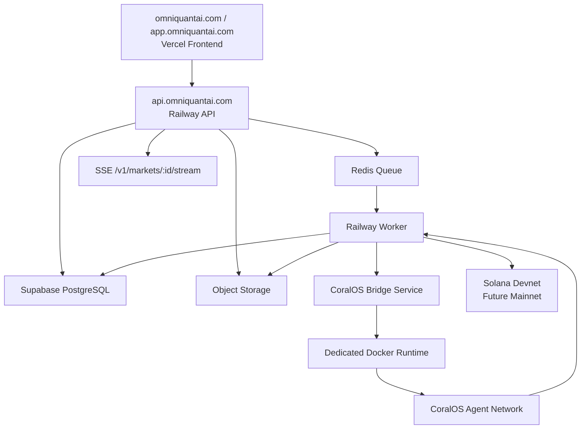

# OmniQuantAI Infrastructure

## Target Architecture

## Current Repository Audit

| Layer | Current location | Production target |
| --- | --- | --- |
| Frontend | `examples/marketplace/web` | `apps/frontend` boundary, Vercel |
| Public API | `examples/marketplace/feed` | `apps/api` boundary, Railway |
| Worker | embedded in API launcher flow | `apps/worker`, Redis/BullMQ |
| CoralOS bridge | `examples/marketplace/start.ts`, `coral-agents/*` | `apps/coral-bridge`, private service |
| CoralOS runtime | `docker-compose.yml` | dedicated Docker host, future Kubernetes |
| Persistence | `.omniquant-data` JSONL, Supabase migration | Supabase PostgreSQL |
| Queue | none | Redis |
| Object storage | local evidence files | S3-compatible object storage |
| Monitoring | logs and smoke tests | structured logs, OpenTelemetry, Sentry, metrics |

## Current Blockers

- API and CoralOS launching are still coupled in the feed server.
- Long-running market startup can block an API request.
- Redis queue and async worker are documented but not yet wired.
- Supabase mirroring is implemented behind `SUPABASE_URL` and `SUPABASE_SERVICE_ROLE_KEY` for market
  records, memo workspaces, memberships/audit, organizations, and organization-session assignments.
  Read APIs prefer Supabase when credentials are configured and fall back to JSONL when Supabase is
  unavailable.
- CoralOS requires Docker and should not run on Vercel.
- Arbiter settlement mode has a known `NotArbiter` posture issue; direct devnet escrow is the reliable proof lane.
- Object storage for memo/proof artifacts is not wired.

## Scalability Issues

- Polling remains supported, but production should prefer `GET /v1/markets/:id/stream`.
- File-backed JSONL persistence is useful for local proof runs but not multi-instance safe.
- Registered dynamic agents need a stronger sandbox execution path before untrusted code runs.
- Docker-host capacity will become the first bottleneck for simultaneous market sessions.

## Single Points Of Failure

- CoralOS Docker runtime
- Solana RPC provider
- Redis queue
- Supabase database
- API runtime
- settlement key material

Mitigations: health checks, retries, provider fallback, settlement reconciliation, and eventually redundant
Docker runners and RPC providers.

## Deployment Risks

- Secrets accidentally exposed through `VITE_*` variables.
- Frontend configured without a reachable `VITE_API_BASE_URL`.
- Worker and API deployed without the same Redis/Supabase configuration.
- CoralOS namespace mismatch between API, worker, and bridge.
- Long-running agents started in a stateless web host.

## Service Boundaries

The migration path is wrapper-first:

1. Keep the working demo in `examples/marketplace`.
2. Add stable `/v1` API endpoints.
3. Deploy the current feed server as `omniquant-api`.
4. Move `start_market` into `omniquant-worker`.
5. Split CoralOS launching into `omniquant-coral-bridge`.
6. Switch persistence from JSONL to Supabase projections.

## Persistence Posture

Current:

- local proof runs write JSONL under `OMNIQUANT_DATA_DIR`
- when Supabase server credentials are configured, the API mirrors supported records to Supabase REST
- core read APIs prefer Supabase when credentials are configured and fall back to JSONL on failure
- Supabase mirror failures are logged and do not break local demo reliability unless `SUPABASE_STRICT=1`
- the SQL schema lives in `docs/supabase_migration.sql`

Supported mirrored collections:

- market sessions
- research requests
- market events
- agent bids
- investment memos
- settlements
- agent reputation
- financial graph nodes
- financial graph edges

Next:

- add settlement reconciliation jobs in the worker
- store large memo/proof artifacts in object storage and persist their object URIs

This avoids breaking the sacred lifecycle while moving toward production-grade infrastructure.
