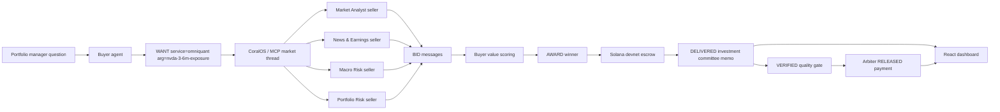

# OmniQuantAI Architecture

## System Flow

## Core Components

| Component | Path | Responsibility |
| --- | --- | --- |
| Buyer agent | `coral-agents/buyer-agent/src/index.ts` | broadcasts research request, receives bids, scores value, opens escrow |
| Seller service | `coral-agents/seller-agent/src/service.ts` | delivers the OmniQuantAI investment committee memo |
| Seller bidding | `coral-agents/seller-agent/src/bidder.ts` | creates bid notes with quality, relevance, confidence, speed, and fit metrics |
| Personas | `coral-agents/*/coral-agent.toml` | configures four financial seller identities |
| Marketplace launcher | `examples/marketplace/start.ts` | starts buyer and sellers in one CoralOS session |
| Dashboard | `examples/marketplace/web` | visualizes bids, settlement, verification, and delivered intelligence |
| Escrow clients | `coral-agents/buyer-agent/src/arbiter.ts`, `coral-agents/seller-agent/src/payment.ts` | preserve the starter kit's Solana devnet escrow flow |

## Buyer Value Score

The buyer scores each bid using:

- relevance,
- expected quality,
- confidence,
- domain fit,
- delivery speed,
- price,
- explanation quality.

This keeps the demo focused on agent-market economics instead of a lowest-price auction.

## Delivery Schema

The winning seller returns:

- request understood,
- investment committee memo,
- portfolio context,
- evidence cards,
- key evidence,
- bull case,
- base case,
- bear case,
- risk factors,
- recommendation,
- confidence score,
- verification score,
- final synthesis,
- human approval reminder,
- research-only disclaimer.

## Demo Reliability

The financial intelligence is deterministic mock data. That choice keeps the judging demo stable while still showing the live CoralOS coordination and Solana devnet escrow mechanics.
