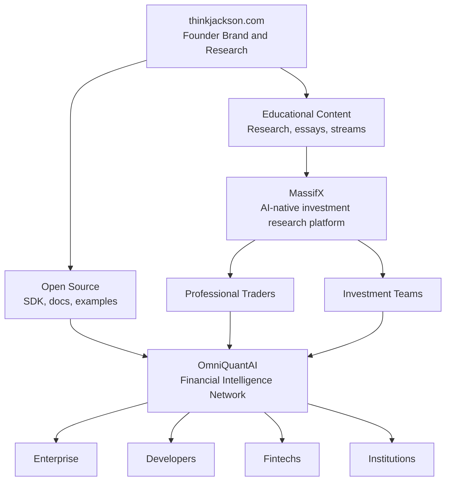

# OmniQuantAI Ecosystem GTM

## Strategic Thesis

OmniQuantAI should not go to market as an abstract infrastructure platform on day one.

The stronger strategy is a layered ecosystem:

```text
thinkjackson.com
-> MassifX
-> OmniQuantAI
```

Each layer has a different job:

| Layer | Role | Primary Audience | Success Metric |
| --- | --- | --- | --- |
| thinkjackson.com | Founder brand and research trust | investors, operators, traders, builders | subscribers, followers, inbound conversations |
| MassifX | Customer acquisition and value proof | professional traders, small funds, investment teams | activation, retention, paid customers, MRR |
| OmniQuantAI | Financial intelligence infrastructure | developers, fintechs, institutions, enterprises | API usage, marketplace volume, integrations |

This sequencing reduces adoption risk. Customers buy a useful application first. The infrastructure story becomes credible after the application proves demand.

## Ecosystem Map



## Layer 1: Founder Brand

thinkjackson.com builds trust before the product asks for trust.

Content themes:

- AI and finance research
- Quantitative investing
- Market structure
- Agentic systems
- Financial engineering
- Architecture decisions
- Build-in-public execution
- Weekly product/research streams

Primary KPIs:

- newsletter subscribers
- LinkedIn followers
- X followers
- GitHub stars
- inbound opportunities
- design-partner conversations

## Layer 2: MassifX

MassifX is the flagship commercial wedge.

Positioning:

> The AI-native investment research platform.

MassifX should sell outcomes:

- better research
- faster decisions
- institutional workflows
- portfolio intelligence
- risk analysis
- weekly research habit formation

MassifX should not lead with CoralOS, Solana, multi-agent orchestration, or the Financial Intelligence Graph. Those are proof and infrastructure, not the first customer promise.

Customer journey:

```text
Find MassifX
-> create account
-> run first research
-> receive investment memo
-> save/share memo
-> return weekly
-> upgrade
-> invite team
-> become daily user
```

Revenue roles:

- Professional plan
- Team plan
- Enterprise workflows
- Premium research

MassifX is the early revenue engine because customers can understand and buy the application immediately.

## Layer 3: OmniQuantAI

OmniQuantAI becomes the platform once MassifX proves demand.

Positioning:

> Financial intelligence infrastructure for autonomous agents, fintechs, and institutions.

Customers ask:

> Can we integrate this into our own system?

The answer is:

> Yes. Use the API, SDK, registry, and private runtime.

OmniQuantAI customers:

- hedge funds
- banks
- fintechs
- brokerages
- AI companies
- developer teams
- institutions needing private research markets

Revenue roles:

- API
- marketplace fees
- enterprise infrastructure
- private deployments
- developer platform

## Growth Flywheel

```text
Founder publishes research
-> people discover thinkjackson.com
-> users try MassifX
-> paying customers generate research markets
-> saved memos and feedback compound
-> Financial Intelligence Graph improves
-> OmniQuantAI infrastructure improves
-> MassifX product improves
-> developers build specialist agents
-> marketplace grows
-> enterprises integrate APIs
-> platform revenue grows
```

## Distribution Strategy

| Brand | Purpose | Channels |
| --- | --- | --- |
| thinkjackson.com | Thought leadership and trust | research essays, newsletter, X, LinkedIn, YouTube, streams |
| MassifX | Customer acquisition | Product Hunt, SEO, trading communities, referrals, founder-led sales |
| OmniQuantAI | Builder and platform adoption | GitHub, docs, SDK, hackathons, API examples, developer relations |

## Sales Motion

Stage 1: founder-led.

Sell MassifX to professional traders, small funds, and investment teams.

Stage 2: product-led.

Scale teams, research firms, and repeat workflows.

Stage 3: platform-led.

Sell OmniQuantAI APIs to fintechs, brokerages, and funds that want integrations.

Stage 4: enterprise-led.

Sell private runtime, dedicated infrastructure, audit logs, roles, compliance posture, and custom agent markets.

## Revenue Evolution

Years 1-2:

| Revenue Source | Share |
| --- | ---: |
| MassifX | 90% |
| OmniQuantAI | 10% |

Years 2-4:

| Revenue Source | Share |
| --- | ---: |
| MassifX | 60% |
| OmniQuantAI | 40% |

Years 5+:

| Revenue Source | Share |
| --- | ---: |
| MassifX | 35% |
| OmniQuantAI | 65% |

## GBP 1M MRR Model

| Revenue Source | Role | Target MRR |
| --- | --- | ---: |
| MassifX Professional | Customer acquisition | GBP 250k |
| MassifX Teams | Team expansion | GBP 250k |
| MassifX Enterprise | Business workflows | GBP 150k |
| OmniQuantAI API | Infrastructure | GBP 150k |
| OmniQuantAI Marketplace | Developer ecosystem | GBP 125k |
| OmniQuantAI Enterprise Infrastructure | Platform | GBP 75k |
| Total |  | GBP 1M |

## Product Implication

The current OmniQuantAI repo should keep strengthening the infrastructure boundary, but the near-term product slices should optimize MassifX-style activation:

```text
workspace
-> asset/objective
-> launch research
-> memo saved
-> feedback captured
-> user returns
```

That workflow produces the evidence needed for paid MassifX pilots while also feeding OmniQuantAI's long-term platform moat.

## Strategic Principle

thinkjackson.com builds trust.

MassifX delivers customer value.

OmniQuantAI captures platform value.

The right sequence is application first, infrastructure second, enterprise platform third.
