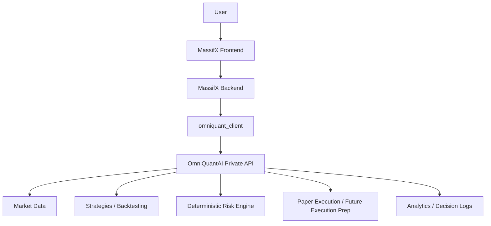

# OmniQuantAI and MassifX Architecture Refactor

Status: active boundary with first migrated backtest endpoint.

## Decision

Treat OmniQuantAI and MassifX as two separate products with one explicit relationship:

- **OmniQuantAI** is the reusable financial intelligence platform.
- **MassifX** is the customer-facing quantitative trading application.
- MassifX consumes OmniQuantAI through one private client: `omniquant_client/`.
- MassifX must not import OmniQuantAI internals or reimplement OmniQuantAI logic.
- OmniQuantAI must not own customer-facing MassifX workflows such as auth, subscriptions, dashboard state, or notifications.

## Current Audit

### OmniQuantAI

Current strengths:

- Working agent-market lifecycle.
- API, worker, and frontend boundaries are documented under `apps/`.
- Persistence is moving toward Supabase-backed read/write projections.
- SDK foundation exists for agent registration and marketplace access.
- Devnet settlement proof and saved memo workspace are working product foundations.

Current gaps:

- `POST /v1/backtests` is implemented as the first OmniQuantAI-owned deterministic quant endpoint.
- `POST /v1/risk/evaluate` is implemented as the second OmniQuantAI-owned deterministic quant endpoint.
- `POST /v1/signals/generate` is implemented as the third OmniQuantAI-owned deterministic quant endpoint.
- `POST /v1/orders/prepare` is implemented as the fourth OmniQuantAI-owned deterministic quant endpoint.
- `POST /v1/orders/execute` is implemented as the fifth OmniQuantAI-owned deterministic quant endpoint for paper-only execution.
- Live execution remains out of scope.
- The working implementation still lives mostly under `examples/marketplace`.
- Current platform focus is financial research and agent markets, not quant strategy execution.
- There is no hosted private API deployment boundary yet.

### MassifX

Inspected local repo:

```text
/Users/mfonisojackson/Documents/Codex/2026-07-09/files-mentioned-by-the-user-you
```

Current strengths:

- Next.js customer-facing application.
- Demo auth, dashboard, strategy marketplace, persistence, and paper trading posture.
- PostgreSQL/Prisma ownership for users, portfolios, strategy activations, decision audits, and backtest ledger.
- Modular packages for core quant logic, data, agents, SDK, and database utilities.

Duplicated or misplaced responsibilities:

- `packages/core` owns backtesting, paper execution, risk, sample data, and strategies. These belong in OmniQuantAI over time.
- `packages/agents` produces trading decisions using strategy/risk concepts. These should call OmniQuantAI instead of owning intelligence logic.
- `packages/sdk` owns strategy plugin manifests and built-ins. Long term, MassifX should only own user strategy configuration and marketplace display; strategy computation should move behind OmniQuantAI.
- `apps/web/app/api/backtest/route.ts` runs backtests inside MassifX. This should become a call to OmniQuantAI.

## Target Architecture



## Repository Responsibilities

### OmniQuantAI Owns

- Market data ingestion.
- Feature engineering.
- Forecasting.
- Strategies and indicators.
- Backtesting.
- Signal generation.
- Deterministic risk evaluation.
- Execution preparation.
- Paper execution simulation.
- Analytics and decision logs.
- Model registry.

### MassifX Owns

- Authentication.
- Users and organizations.
- Portfolios.
- Subscription plans and billing.
- Strategy configuration.
- Dashboard and reporting UX.
- Notifications.
- Permissions.
- Customer workflow state.

## Private API Contract

The initial private API surface is intentionally small:

```text
GET  /v1/health
POST /v1/backtests
POST /v1/signals/generate
POST /v1/risk/evaluate
POST /v1/orders/prepare
POST /v1/orders/execute
GET  /v1/models
```

Do not add endpoints until MassifX has an immediate workflow that needs them.

`POST /v1/backtests` now accepts MassifX-style candle payloads and returns a stable deterministic
backtest shape with totals, drawdown, Sharpe ratio, win rate, trades, equity curve, and engine
metadata. If valid candles are not provided, OmniQuantAI uses deterministic demo candles so contract
tests and local development remain reliable.

`POST /v1/risk/evaluate` now enforces deterministic controls for max position size, leverage,
stop-loss, max drawdown, daily loss, stale market data, kill switch, volatility, and open-position
limits. The response returns approval, refusal reasons, caps, per-check booleans, and engine metadata.

`POST /v1/signals/generate` now evaluates deterministic strategy signals for trend following, mean
reversion, breakout, and volatility-regime strategies. MassifX keeps regime/selector orchestration
but asks OmniQuantAI to produce the selected strategy decision before falling back locally.

`POST /v1/orders/prepare` now prepares paper orders after risk approval. It validates executable side,
positive quantity, limit price requirements, and risk approval, then returns a prepared/rejected order
with deterministic refusal reasons. MassifX still owns the customer-facing paper account simulation.

`POST /v1/orders/execute` now performs paper-only execution of a prepared order against a supplied
paper account. It updates paper balance, open positions, and trades deterministically. Live exchange
execution remains explicitly unsupported.

All private `/v1` requests now carry request IDs for traceability. The server returns `x-request-id`,
emits structured JSON request logs, and enforces bearer-token auth whenever `OMNIQUANT_API_KEY` is
configured. MassifX clients send `x-request-id` and the optional `OMNIQUANT_API_KEY` bearer token on
each private API call.

## Initial Workflow Boundary

MassifX should orchestrate the customer workflow:

```text
Configure Strategy -> Run Backtest -> View Results -> Enable Paper Trading -> Generate Signal
-> Risk Evaluation -> Paper Execution -> Portfolio Update
```

OmniQuantAI should execute the intelligence steps:

```text
Run Backtest -> Generate Signal -> Evaluate Risk -> Prepare Order -> Execute Paper Order
```

MassifX persists the user-facing portfolio update. OmniQuantAI persists the backtest, signal, risk log,
execution log, and model/version metadata.

## Risk Engine Rules

Risk is deterministic and non-overridable by AI.

Minimum controls:

- maximum position size
- maximum leverage
- stop-loss validation
- maximum drawdown
- daily loss limit
- stale market data protection
- kill switch

The initial `omniquant_client` exposes `executePaperOrder` only. Live execution remains explicitly out of
scope until the risk and deployment gates are complete.

## Migration Plan

### Phase 1: Boundary First

- Add `omniquant_client/` to OmniQuantAI.
- Update MassifX API routes to call the client for backtests and signals.
- Keep MassifX local core packages in place as fallback during migration.
- Add contract tests around client paths and response shapes.

### Phase 2: Move Intelligence Logic

- Move deterministic risk, backtesting, signal generation, and paper execution logic into OmniQuantAI.
- Replace MassifX imports from `@massifx/core`, `@massifx/agents`, and strategy SDK internals with `omniquant_client` calls.
- Keep MassifX database ownership for users, portfolios, subscriptions, and strategy configuration.

### Phase 3: Deploy Privately

- Deploy MassifX and OmniQuantAI separately.
- Put OmniQuantAI on a private network or authenticated internal route.
- Add structured logs, request IDs, and service-level health checks.
- Add Postgres/Redis-backed persistence for OmniQuantAI quant records.

## Technical Debt Report

- MassifX currently contains business logic that should move into OmniQuantAI.
- OmniQuantAI currently lacks the quant API implementation needed to fully replace MassifX core logic.
- There is no shared contract test suite between repos yet.
- The private API authentication model needs to be finalized before deployment.
- Docker Compose should eventually launch MassifX, OmniQuantAI, PostgreSQL, and Redis together, but this should wait until the private API exists.

## Non-Goals

- No Kubernetes.
- No GraphQL.
- No service mesh.
- No public SDK.
- No blockchain integration for MassifX.
- No multi-agent orchestration for this refactor.
- No live exchange execution in the initial boundary slice.

## First Implemented Slice

This repo now includes:

```text
omniquant_client/
examples/marketplace/feed/src/privateQuantApi.ts
```

The client provides one typed boundary for MassifX to call OmniQuantAI. The feed API now exposes a
minimal private quant API shell plus the first migrated quant engine:

- `GET /v1/health` returns `boundary-ready`
- `GET /v1/models` returns an empty model registry projection
- `POST /v1/backtests` runs the deterministic trend-following backtest engine inside OmniQuantAI
- `POST /v1/risk/evaluate` runs deterministic non-LLM risk controls inside OmniQuantAI
- `POST /v1/signals/generate` runs deterministic selected-strategy signal generation inside OmniQuantAI
- `POST /v1/orders/prepare` runs deterministic paper-order preparation inside OmniQuantAI
- `POST /v1/orders/execute` runs deterministic paper execution inside OmniQuantAI

This prevents further responsibility leakage while moving customer-facing MassifX backtests behind
the OmniQuantAI private API boundary one route at a time.
