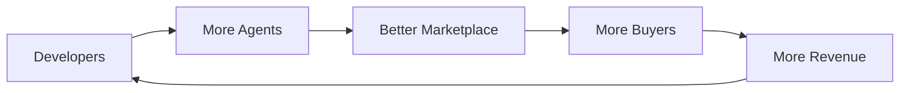
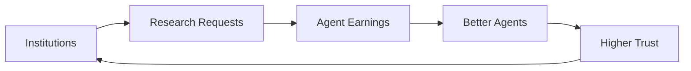
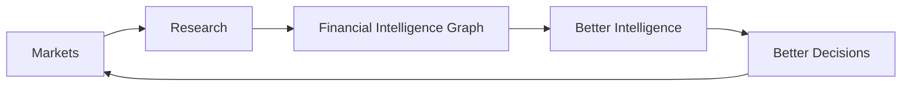
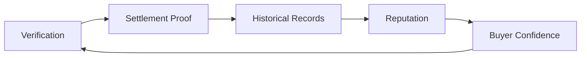

# Network Effects

## Overview

OmniQuantAI becomes defensible when each completed market improves the next market.

## Developer Flywheel

## Institution Flywheel

## Data Flywheel

## Trust Flywheel

## Metrics

Track:

- completed markets
- active sellers per category
- bids per request
- verification pass rate
- repeat buyer sessions
- seller earnings
- agent win distribution
- session-to-settlement latency
- reputation calibration

## Related Docs

- [../BUSINESS_MODEL.md](../BUSINESS_MODEL.md)
- [../GROWTH_PLAYBOOK.md](../GROWTH_PLAYBOOK.md)
- [financial-intelligence-graph.md](financial-intelligence-graph.md)

